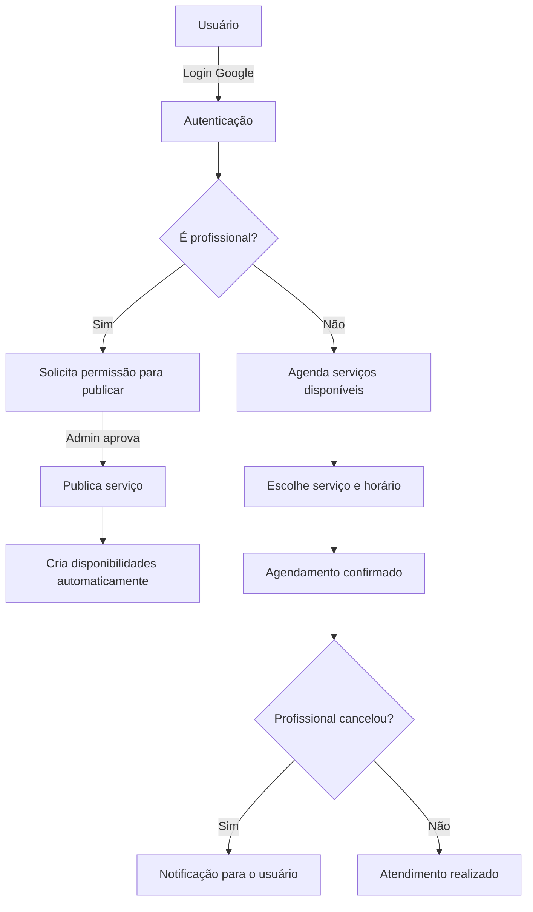

# Centro Social da Igreja - Flutter + Supabase

Sistema de gestão para Centro Social da Igreja com serviços gratuitos comunitários (psicologia, médico, jurídico, eventos etc.), construído em arquitetura modular limpa (Clean Architecture) e preparado para evolução SaaS.

---

## 📋 Funcionalidades

- **Autenticação** com Supabase Auth (Google OAuth + PKCE)
- **Serviços comunitários**: Publicação, aprovação e agendamento
- **Agendamento automático** com validação de conflitos
- **Perfil de usuário** simplificado
- **Eventos**: Criação, inscrição e voluntariado
- **Painel administrativo**: Gerenciamento de admins, permissões e relatórios
- **Notificações de cancelamento** para usuários da comunidade

---

## 🏗️ Arquitetura

O projeto segue os princípios da **Clean Architecture** dividido em camadas:

```
lib/
├── main.dart                          # Ponto de entrada do app
└── src/
    ├── app.dart                       # Widget raiz com tema Material 3
    ├── nucleo/                        # Núcleo compartilhado
    │   ├── configuracao/              # Configurações (Supabase, OAuth)
    │   └── navegacao/                 # Observador de rotas
    ├── funcionalidades/               # Módulos funcionais
    │   ├── autenticacao/              # Login, cadastro, OAuth
    │   │   ├── dados/                 # Repositório (Supabase)
    │   │   ├── dominio/               # Entidades e interfaces
    │   │   └── apresentacao/          # Telas e provedores de estado
    │   ├── agendamentos/              # Serviços e agendamentos
    │   │   ├── dados/                 # Repositório (Supabase)
    │   │   ├── dominio/               # Entidades e interfaces
    │   │   └── apresentacao/          # Telas e provedores
    │   ├── servicos/                  # Publicação de serviços
    │   │   └── apresentacao/          # Componentes e telas
    │   ├── eventos/                   # Eventos comunitários
    │   │   ├── dados/                 # Repositório (Supabase)
    │   │   ├── dominio/               # Entidades
    │   │   └── apresentacao/          # Telas e provedores
    │   ├── administracao/             # Painel admin
    │   │   ├── dados/                 # Repositório (Supabase)
    │   │   └── apresentacao/          # Telas e provedores
    │   ├── inicio/                    # Home pages
    │   │   └── apresentacao/          # Telas (comunidade, voluntário, shell)
    │   └── perfil/                    # Perfil do usuário
    │       └── apresentacao/          # Componentes e telas
    └── features/                      # (Estrutura legada - em migração)
        └── home/
```

### 📐 Clean Architecture (por módulo)

Cada funcionalidade segue a separação em 3 camadas:

| Camada | Função | Exemplo |
|--------|--------|---------|
| **domínio/** | Entidades, interfaces de repositório, casos de uso | `Appointment`, `SchedulingRepository` |
| **dados/** | Implementação dos repositórios (Supabase) | `SchedulingRepositoryImpl` |
| **apresentação/** | Widgets, telas, provedores de estado (Riverpod) | `PaginaAgendamentosUsuario`, `ProvedoresAgendamento` |

---

## 🚀 Tecnologias

- **Flutter** 3.x + Dart 3.x
- **Supabase** (Auth, Database, Storage, Realtime)
- **Riverpod** (Gerenciamento de estado)
- **Material 3** (Design system)
- **Google OAuth** (Autenticação social)

---

## ⚙️ Configuração

### Variáveis de ambiente (--dart-define)

```bash
flutter run --dart-define=SUPABASE_URL=sua_url \
            --dart-define=SUPABASE_ANON_KEY=sua_chave
```

### Scripts SQL

Os scripts de setup do banco estão em `supabase/`. Execute na ordem:

1. `schema.sql` - Estrutura completa do banco
2. `SETUP_ADMINISTRADOR.sql` - Configuração de admin
3. `SETUP_EVENTOS.sql` - Configuração de eventos
4. Demais scripts conforme necessidade (permissões, correções)

---

## 🤝 Fluxo do Sistema



---

## 📄 Licença

Projeto privado - Centro Social da Igreja.